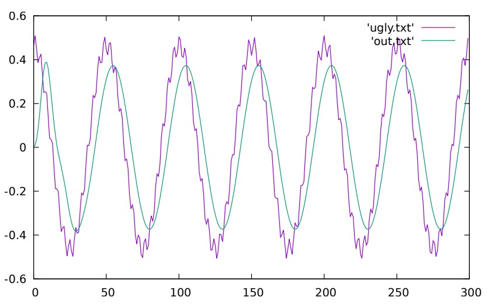

# Biquad Filter
**Course:** CSCB09: Software Tools and Systems Programming Summer 2019 

**Professor:** Albert Lai

**Assignment:** 3

An implementation of a biquad filter that suppresses high frequencies while preserving low frequencies using Unix pipes to chain program instances together.



Plotted with `gnuplot` 

## Files
### Work supplied by, and credited to Professor Albert Lai:
- towav.c 
  - converts WAV files to readable input for the program
- unwav.c
  - converts output of program to a WAV file
- ugly.wav
  - starting frequency to work with
- All command line arguments and pipelines

### Personal Work
- biquad.c
  - an implementation of the difference equation given by :

- cascade.c
  - utilizes biquad.c to create multiple pipelines of biquad.c for use in filtering

## Running the Files
Requires a C compiler and *nix Environment

Listen to ugly.wav

Compilation with GCC compiler:
```shell
$ gcc biquad.c -o biquad
$ gcc cascade.c -o cascade
$ gcc towav.c -o towav
$ gcc unwav.c -o unwav
```
Piping biquad instances:
```shell
$ ./unwav < ugly.wav | ./biquad 1 0 1 -0.7 0 \
| ./biquad 1 1.18 1 -1.58 0.81 \
| ./biquad 4.42e-3 1 0 0 0 | ./towav > out.wav
```
Then listen to out.wav and see if you can spot the frequency difference!

Alternatively, we can use cascade.c to implement the pipeline instead which will create the same result:
```shell
$ ./unwav < ugly.wav \
| ./cascade 1 0 1 -0.7 0 1 1.18 1 -1.58 0.81 4.42e-3 1 0 0 0 \
| ./towav > out.wav
```

The plot in the first section was generated by:
```shell
$ ./unwav < ugly.wav | head -300 > ugly.txt
$ ./unwav < out.wav | head -300 > out.txt
$ 
$ gnuplot
$ plot 'ugly.txt' with lines, 'out.txt' with lines
```